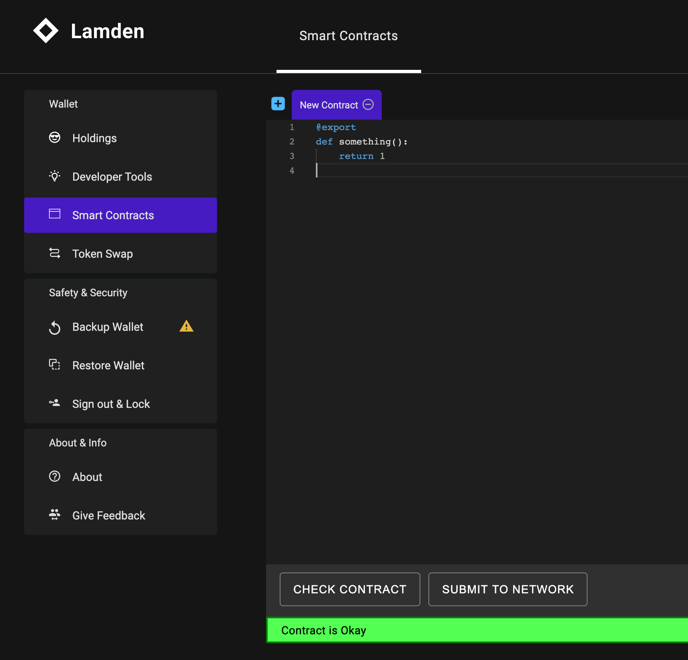
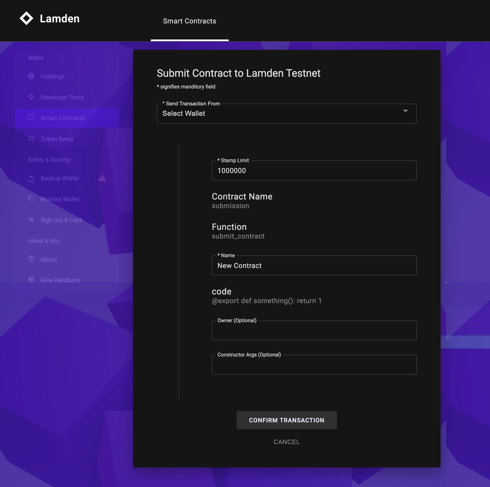
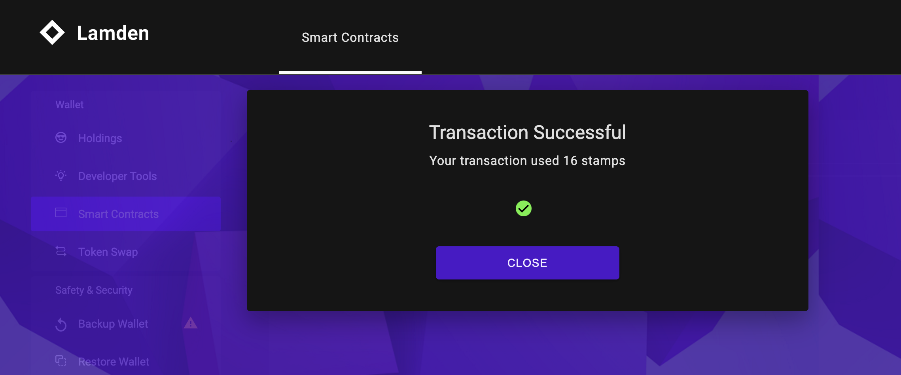

## Intro

After you've finished developing your new smart contract, you will want to test, and finally upload the code to the Lamden blockchain so that others can submit transactions onto it. 

You can do this either programmatically, or through the wallet.

### Submitting Programmatically

You'll need to install the Lamden blockchain Python package to submit transactions to the network. Run the following in a terminal:

```
pip install lamden
```

*NOTE: You may have pip3 installed. Use the according package manager to fit your environment and version of Python.*

#### Extracting Your Smart Contract

If you choose to write your smart contract as a closure, you'll have to extract the core smart contract code first before you submit it. This is done simply by running `closure_to_code_string()` on your Contracting client like below:

```python
def con_hello():
	@export
	def something():
		return 1

client = ContractingClient()

code, name = client.closure_to_code_string(hello)
```

```python
>>> code
'@export\ndef something():\n    return 1\n'

>>> name
'con_hello'
```

#### Creating a Submission Transaction
You now need to serialize a Lamden transaction using the core Python codebase. You can do this by creating your wallet object and building the correct transaction. To send a transaction, you have to gather the correct nonce from a masternode first.

```python
# Import libraries
from lamden.crypto.wallet import Wallet
from lamden.crypto.transaction import build_transaction
import requests

# Create wallet
my_wallet = Wallet('<SK HERE AS HEX STRING>')

# Get Nonce
masternode_url = 'https://masternode-01.lamden.io'
res = requests.get(f'{masternode_url}/nonce/{my_wallet.verifying_key}')

nonce = res.json()['nonce']
processor = res.json()['processor']
```

After this, you can create the payload:

```python
stamps = 100 # 100 stamps is good for most transaction payloads

# Pushing a transaction is similar to intracting with smart contracts via the client
contract = 'submission'
function = 'submit_contract'

kwargs = {
	'code': code,
	'name': name
}

tx = build_transaction(
	    wallet=sender,
	    processor=processor,
	    stamps=stamps,
	    nonce=nonce,
	    contract=contract,
	    function=function,
	    kwargs=kwargs
	)

# You can submit the transaction through any Python HTTP library
response = requests.post(masternode_url, data=tx, verify=False)

>>> response.json()
{
	"success":"Transaction successfully submitted to the network.",
	"hash":"34de48f5143aed44e87c8d8f051749a96ea0ce94638a142775dcd87fd3f9a1a1"
}
```

You can now view the transaction as it has been processed via the `tx` route. Here is how to do it via the HTTP API:

```python
tx_hash = response.json()['hash']
payload = {
	'hash': tx_hash
}
res = requests.get(f'{masternode_url}/tx', params=payload)
```

### Submitting Manually

Submitting through the wallet is much simpler. The wallet has a special 'Smart Contract' section that lints and parses your code to make sure it will submit. If you developed your code in a closure, remember to remove the closure first. This can be as simple as copy and pasting and using Shift+Tab to collapse the tabs, or using your choice of text editor.



Simply press 'Submit to Network' and fill out the metadata inputs to push your transaction.



Click on 'Confirm Transaction' and you're done!



### Changing the Developer

If you want to recieve your developer rewards into a different wallet or smart contract, you can send a transaction to the `submission` smart contract.

| Contract Name | Function Name | `contract`      | `new_developer`    |
|---------------|---------------|-----------------|--------------------|
| submission    | approve       | `contract name` | `developer name`   |

